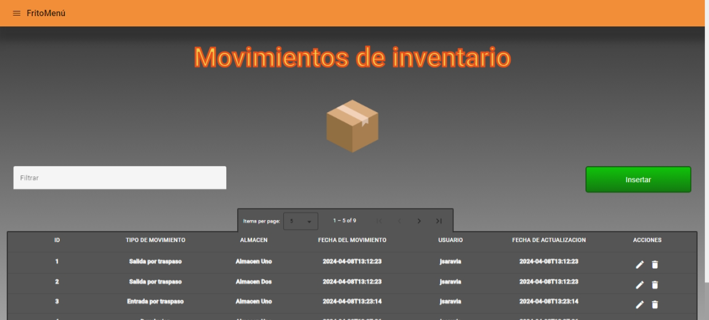
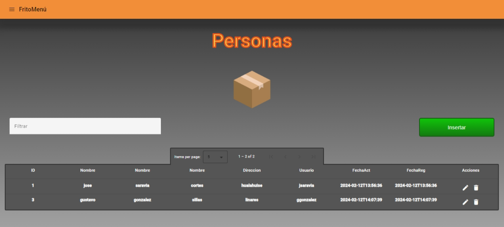
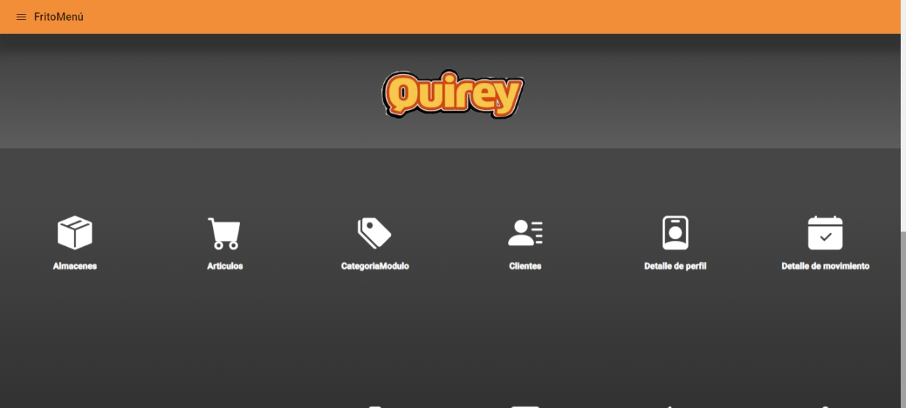

# 27sxkl

This project was generated with [Angular CLI](https://github.com/angular/angular-cli) version 16.2.4.

## Development server

Run `ng serve` for a dev server. Navigate to `http://localhost:4200/`. The application will automatically reload if you change any of the source files.

## Code scaffolding

Run `ng generate component component-name` to generate a new component. You can also use `ng generate directive|pipe|service|class|guard|interface|enum|module`.

## Build

Run `ng build` to build the project. The build artifacts will be stored in the `dist/` directory.

## Running unit tests

Run `ng test` to execute the unit tests via [Karma](https://karma-runner.github.io).

## Running end-to-end tests

Run `ng e2e` to execute the end-to-end tests via a platform of your choice. To use this command, you need to first add a package that implements end-to-end testing capabilities.

## Further help

To get more help on the Angular CLI use `ng help` or go check out the [Angular CLI Overview and Command Reference](https://angular.io/cli) page.

V01

//==================================================================================================================
Proyecto Primer Parcial TICSM05

Este modulo muestra los empleados registrados en la tabla

Esto modulo muestra los puestos registrados en la tabla

Este modulo muestra las categorias registrados en la tabla y darle la categoria al modulo

Este modulo nos sirve para relacionar el perfil y la categoria del modulo

Este modulo nos sirve para mostrar, insertar y actualizar datos relacionados a detalle perfil

Integrantes del Equipo
//==========================================================================
-Jose Reynaldo Silla Guerrero
-Jonathan Cortes Perez
-Brandon Arturo Saravia Gonzalez
-Gustavo Angel Borrego Ramirez
-Carlos Alvarez Montes